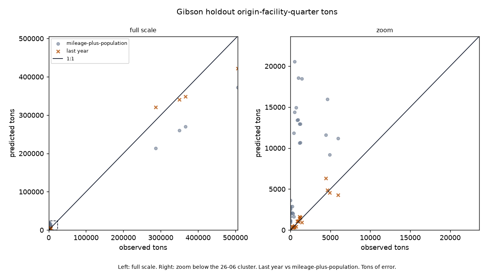
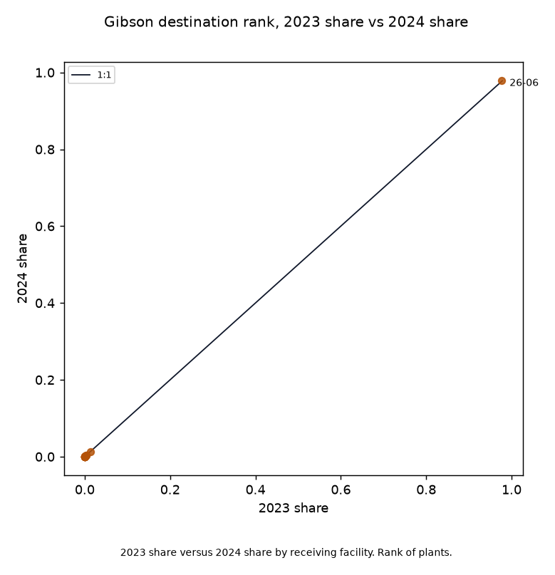

# Indiana Gibson origin last-year Re-TRAC shipments vs mileage-plus-population

On Gibson origin-facility-quarter cells, do last year’s same-quarter shipments beat mileage-plus-population on held-out 2024?

Three sentences. Last year wins assignment on 35 cells (15,596.8 vs 35,014.7). Last year loses the four quarter totals (45,939.1 vs 0.0). 97.8% of reported Gibson-origin tons in 2024 went to 26-06, a Restricted Waste Site Type I (Duke CCR), not MSW. Locked `c89de5b`. That is the product. Do not average the first two. On the 35 cells where last year exists, last-year RMSE is 15596.8 tons against mileage-plus-population 35014.7. MAE is 4329.1 against 17462.2. Bar RMSE on all 48 reported 2024 Gibson cells is 30039.5, a second line, not mixed into the win. Origin-quarter RMSE 45939.1 against 0.0 is the second answer: the bar is scaled to the observed quarterly total. Last year is a lag-4 copy of last year’s total. Origin population cancels inside one origin’s shares. Confirmation 2025 last-year RMSE 22855.3 against 36332.2 does not reopen the page. Fixture skill does not rescue live.

Parent `5800fc3` ([indiana_retrac_last_year](https://github.com/martialsystems/indiana_retrac_last_year)) is the statewide baseline citation only. That lock: last year wins assignment on intersection cells (RMSE 6504.7 vs 16633.0, n=4370); last year loses origin-quarter totals (23313.3 vs 0.0, bar scaled to the observed county total). That lock’s Gibson row used statewide facility set J: last-year RMSE 15597 vs bar 76281; holdout tons 1540946; n=35. This tree does not restamp `5800fc3` and does not promote a statewide win. Facility set J here is the 21 train-era Gibson destinations. 18 of the Gibson destination set sit on IndianaMap points; 9 use the host-county centroid. CRS is EPSG:4326, warp none.

Science lock: public IDEM waste-received XLSX 2021 through 2025 (`e4a8ece1b09c…`). Not a live Re-TRAC login. Train: 2021 Q1 through 2023 Q4. Holdout: 2024. Confirmation 2025 is out of train and out of J. 31965 out-of-state source rows dropped from the lead.



Figure 1. Holdout tons. Last year RMSE 15596.8 vs mileage-plus-population 35014.7. Tons of error, not a landfill siting.



Figure 2. 2023 share versus 2024 share by receiving facility. Rank of plants. 26-06 holds 97.8% of 2024 reported tons.

## Residual

26-06 is a centroid.
Miles are great-circle.
Out-of-state origin rows are dropped.

## Live skill (held-out 2024, Gibson origin)

Locked from `logs/in_live/stage_c_report.json`. RMSE in tons.

| Universe | Last year RMSE | Bar RMSE | n |
|----------|---------------:|---------:|--:|
| Intersection cells (last year present) | 15596.8 | 35014.7 | 35 |
| All reported Gibson holdout cells | | 30039.5 | 48 |
| Gibson origin-quarter totals | 45939.1 | 0.0 | 4 |

## Destination type (2024 Gibson-origin tons)

GIS `facility_type`, with 26-06 labeled Restricted Waste Site Type I (Duke CCR). Rows are public IDEM.

| ID | Facility | Type | 2024 tons | Share | Loc |
|----|----------|------|----------:|------:|-----|
| 26-06 | Gibson Generating Station RWS 1 South Landfill | Restricted Waste Site Type I (Duke CCR) | 1,507,685.0 | 97.8% | centroid |
| 63-04 | Advanced Disposal Services Blackfoot Landfill | Municipal Solid Waste Landfill | 19,988.5 | 1.3% | point |
| 63-07 | Velpen CD Landfill | Construction/Demolition Site | 4,559.0 | 0.3% | centroid |
| 82-02 | Laubscher Meadows Landfill | Municipal Solid Waste Landfill | 4,426.3 | 0.3% | point |
| 82-20 | Evansville Transfer Station | Transfer Station | 2,161.8 | 0.1% | point |
| 49-64 | Covanta Environmental Solutions, LLC | Solidification Facility | 1,227.5 | 0.1% | centroid |
| 87-13 | Warrick Processing Center | Resource Recovery System | 833.4 | 0.1% | centroid |
| 42-09 | Vincennes Transfer Station | Transfer Station | 21.0 | 0.0% | point |
| 10-01 | Clark Floyd Landfill | Municipal Solid Waste Landfill | 15.8 | 0.0% | point |
| 84-06 | Sycamore Ridge Landfill | Municipal Solid Waste Landfill | 8.0 | 0.0% | point |
| 32-02 | Twin Bridges Landfill | Municipal Solid Waste Landfill | 7.9 | 0.0% | point |
| 49-066 | CW Recycling LLC | Material Recovery Facility | 5.6 | 0.0% | point |
| 53-009 | Monroe County Resource Recovery Facility | Transfer Station | 3.8 | 0.0% | point |
| 49-61 | CYNTOX LLC | Medical Waste Processor | 1.2 | 0.0% | centroid |
| 45-47 | Tradebe Treatment & Recycling, LLC | Solidification Facility | 0.6 | 0.0% | point |
| 49-57 | Clean Earth Environmental Solutions, Inc. | Resource Recovery System | 0.3 | 0.0% | point |
| 10-014 | Specific Waste Industries LLC | Medical Waste Processor | 0.3 | 0.0% | point |

## Gibson 2024 reported cells

Forty-eight origin-facility-quarter rows. Residual is 2024 tons minus 2023 same-quarter tons. Blank 2023 is a 2024-only cell.

| Q | ID | Facility | Type | 2023 tons | 2024 tons | Residual | Loc |
|--:|----|----------|------|----------:|----------:|---------:|-----|
| 1 | 26-06 | Gibson Generating Station RWS 1 South Landfill | Restricted Waste Site Type I (Duke CCR) | 340,880.0 | 349,960.0 | 9,080.0 | centroid |
| 2 | 26-06 | Gibson Generating Station RWS 1 South Landfill | Restricted Waste Site Type I (Duke CCR) | 320,810.0 | 286,300.0 | -34,510.0 | centroid |
| 3 | 26-06 | Gibson Generating Station RWS 1 South Landfill | Restricted Waste Site Type I (Duke CCR) | 422,360.0 | 505,615.0 | 83,255.0 | centroid |
| 4 | 26-06 | Gibson Generating Station RWS 1 South Landfill | Restricted Waste Site Type I (Duke CCR) | 348,440.0 | 365,810.0 | 17,370.0 | centroid |
| 1 | 63-04 | Advanced Disposal Services Blackfoot Landfill | Municipal Solid Waste Landfill | 4,263.0 | 5,987.2 | 1,724.3 | point |
| 2 | 63-04 | Advanced Disposal Services Blackfoot Landfill | Municipal Solid Waste Landfill | 4,535.1 | 4,914.5 | 379.3 | point |
| 3 | 63-04 | Advanced Disposal Services Blackfoot Landfill | Municipal Solid Waste Landfill | 4,892.0 | 4,649.8 | -242.3 | point |
| 4 | 63-04 | Advanced Disposal Services Blackfoot Landfill | Municipal Solid Waste Landfill | 6,295.1 | 4,437.1 | -1,858.0 | point |
| 1 | 63-07 | Velpen CD Landfill | Construction/Demolition Site | 1,383.1 | 1,143.6 | -239.5 | centroid |
| 2 | 63-07 | Velpen CD Landfill | Construction/Demolition Site | 1,643.0 | 1,142.1 | -500.9 | centroid |
| 3 | 63-07 | Velpen CD Landfill | Construction/Demolition Site | 925.4 | 1,406.0 | 480.6 | centroid |
| 4 | 63-07 | Velpen CD Landfill | Construction/Demolition Site | 1,077.0 | 867.4 | -209.6 | centroid |
| 1 | 82-02 | Laubscher Meadows Landfill | Municipal Solid Waste Landfill | 1,554.7 | 1,243.9 | -310.8 | point |
| 2 | 82-02 | Laubscher Meadows Landfill | Municipal Solid Waste Landfill | 1,525.0 | 1,242.8 | -282.1 | point |
| 3 | 82-02 | Laubscher Meadows Landfill | Municipal Solid Waste Landfill | 1,118.0 | 992.2 | -125.8 | point |
| 4 | 82-02 | Laubscher Meadows Landfill | Municipal Solid Waste Landfill | 1,038.5 | 947.3 | -91.2 | point |
| 1 | 82-20 | Evansville Transfer Station | Transfer Station | 344.6 | 518.2 | 173.6 | point |
| 2 | 82-20 | Evansville Transfer Station | Transfer Station | 418.4 | 419.4 | 1.0 | point |
| 3 | 82-20 | Evansville Transfer Station | Transfer Station | 498.0 | 534.0 | 36.0 | point |
| 4 | 82-20 | Evansville Transfer Station | Transfer Station | 405.7 | 690.1 | 284.4 | point |
| 1 | 49-64 | Covanta Environmental Solutions, LLC | Solidification Facility | 284.1 | 321.1 | 37.0 | centroid |
| 2 | 49-64 | Covanta Environmental Solutions, LLC | Solidification Facility | 345.7 | 402.8 | 57.1 | centroid |
| 3 | 49-64 | Covanta Environmental Solutions, LLC | Solidification Facility | 365.5 | 249.3 | -116.2 | centroid |
| 4 | 49-64 | Covanta Environmental Solutions, LLC | Solidification Facility | 405.9 | 254.3 | -151.6 | centroid |
| 1 | 49-61 | CYNTOX LLC | Medical Waste Processor | 0.5 | 0.2 | -0.3 | centroid |
| 2 | 49-61 | CYNTOX LLC | Medical Waste Processor | 0.3 | 0.5 | 0.2 | centroid |
| 3 | 49-61 | CYNTOX LLC | Medical Waste Processor | 0.3 | 0.3 | 0.1 | centroid |
| 4 | 49-61 | CYNTOX LLC | Medical Waste Processor | 0.6 | 0.2 | -0.3 | centroid |
| 1 | 10-014 | Specific Waste Industries LLC | Medical Waste Processor | 0.1 | 0.1 | -0.0 | point |
| 2 | 10-014 | Specific Waste Industries LLC | Medical Waste Processor | 0.1 | 0.1 | 0.1 | point |
| 3 | 10-014 | Specific Waste Industries LLC | Medical Waste Processor | 0.1 | 0.1 | 0.0 | point |
| 4 | 10-014 | Specific Waste Industries LLC | Medical Waste Processor | 0.1 | 0.1 | 0.0 | point |
| 1 | 49-57 | Clean Earth Environmental Solutions, Inc. | Resource Recovery System | 0.0 | 0.0 | -0.0 | point |
| 2 | 49-57 | Clean Earth Environmental Solutions, Inc. | Resource Recovery System | 0.1 | 0.1 | 0.0 | point |
| 3 | 49-57 | Clean Earth Environmental Solutions, Inc. | Resource Recovery System |  | 0.1 |  | point |
| 4 | 49-57 | Clean Earth Environmental Solutions, Inc. | Resource Recovery System | 0.1 | 0.1 | -0.0 | point |
| 2 | 87-13 | Warrick Processing Center | Resource Recovery System |  | 833.4 |  | centroid |
| 4 | 10-01 | Clark Floyd Landfill | Municipal Solid Waste Landfill |  | 15.8 |  | point |
| 1 | 42-09 | Vincennes Transfer Station | Transfer Station |  | 3.0 |  | point |
| 3 | 42-09 | Vincennes Transfer Station | Transfer Station |  | 11.0 |  | point |
| 4 | 42-09 | Vincennes Transfer Station | Transfer Station |  | 7.0 |  | point |
| 3 | 84-06 | Sycamore Ridge Landfill | Municipal Solid Waste Landfill |  | 8.0 |  | point |
| 1 | 32-02 | Twin Bridges Landfill | Municipal Solid Waste Landfill |  | 3.5 |  | point |
| 4 | 32-02 | Twin Bridges Landfill | Municipal Solid Waste Landfill |  | 4.4 |  | point |
| 2 | 53-009 | Monroe County Resource Recovery Facility | Transfer Station |  | 3.8 |  | point |
| 1 | 49-066 | CW Recycling LLC | Material Recovery Facility |  | 3.7 |  | point |
| 2 | 49-066 | CW Recycling LLC | Material Recovery Facility |  | 1.9 |  | point |
| 1 | 45-47 | Tradebe Treatment & Recycling, LLC | Solidification Facility |  | 0.6 |  | point |

## Stage 0

One synthetic origin with planted last-year persistence. Fixture skill does not rescue live.

```bash
python3.12 -m venv .venv
source .venv/bin/activate
pip install -r requirements.txt
PYTHONPATH=src:. python3 scripts/run_fixture.py logs/stage0_fixture
.venv/bin/python -m pytest tests -q
PYTHONPATH=src:. python3 scripts/run_live.py logs/in_live data/raw
```

Empty IDEM XLSX, unmatched origin county, missing facility coordinates, or missing CRS stops (`run_live.py` exit 2). Stage 0 fixture before live. Two figures max. Do not re-run live onto `logs/in_live`: the lock is frozen at `c89de5b`.

| File | Role |
|------|------|
| [METHODOLOGY.md](METHODOLOGY.md) | Locked contract |
| [AGENTS.md](AGENTS.md) | Agent rules |
| [CHECKLIST.md](CHECKLIST.md) | Operator list |
| `src/gibson/` | XLSX join, inverse-miles bar, last year, figures |
| `gibsonforge/` | GraphForge pin |
